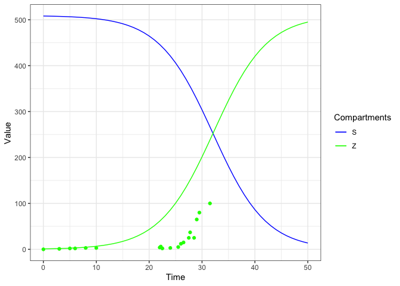
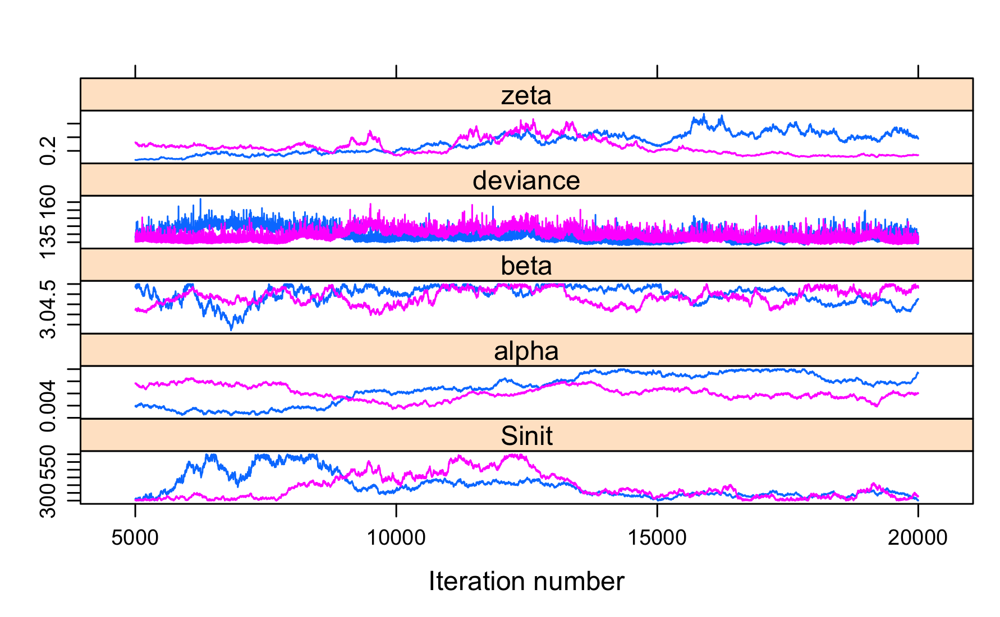
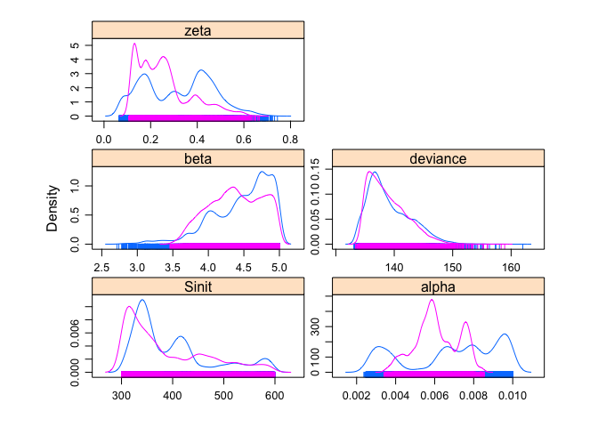
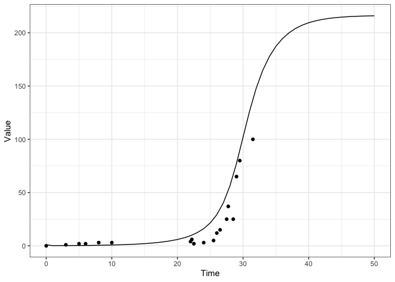

# Zombie apocalypse: A Bayesian approach for fitting an epidemic model to data in R using OpenBUGS

Motivation
----------

In our team, we work a lot with state-space models in which the
ecological (aka state) process is explicitely distinguished from the
observation process. Recently, we had to consider a system of ordinary
differential equations (ODEs) for the ecological process. In other
words, we had to fit a model expressed as a system of ODEs to
time-series data. Here I show how to do exactly that with the good old
OpenBUGS with a toy example using (not so) fake data on zombie invasion
and epidemic models. Note that these models can also be fitted in Stan
(see the awesome Lotka-Volterra example
[here](https://mc-stan.org/users/documentation/case-studies/lotka-volterra-predator-prey.html))
or using R packages like [deBInfer](https://github.com/pboesu/debinfer)
or
[mecastat](https://gitlab.paca.inra.fr/jfrey/jags-module/tree/19b5aefe1ff1b4cf494461650820f802eadc7ff5/mecastat).

Example
-------

To illustrate the approach, I use data from a paper by Witkowski and
Brais [‘Bayesian Analysis of Epidemics - Zombies, Influenza, and other
Diseases’](https://arxiv.org/abs/1311.6376) who provide a Python
solution to the problem (see Notebook
[here](https://gist.github.com/bblais/181abd99f878282666b98a29588dda41).
Briefly speaking, the authors counted the number of living deads in
several famous zombie movies. I use the data from [Shaun of the
Dead](https://www.imdb.com/title/tt0365748/).

First, we load the packages we will need:

    library(R2OpenBUGS)
    library(coda)
    library(deSolve)
    library(ggplot2)
    library(lattice)

Now read in the data from Shaun of the Dead:

    tgrid <- c(0.00, 3.00, 5.00, 6.00, 8.00, 10.00, 22.00, 22.20, 22.50, 24.00, 25.50, 26.00, 26.50, 27.50, 27.75, 28.50, 29.00, 29.50, 31.50) 
    zombies <- c(0, 1, 2, 2, 3, 3, 4, 6, 2, 3, 5, 12, 15, 25, 37, 25, 65, 80, 100)

The authors propose the following epidemic model to capture the zombie
apocalypse:
$$\\begin{align}
\\frac{dS}{dt} & = - \\beta S Z \\\\
\\frac{dE}{dt} & = \\beta S Z - \\zeta E \\\\
\\frac{dZ}{dt} & = \\zeta E - \\alpha SZ  \\\\
\\frac{dR}{dt} & =  \\alpha S Z 
\\end{align}$$

Let us solve this system:

    beta <- 0.2
    zeta <- 6
    alpha <- 0
    Sinit <- 508.2
    shaun <- function(t, y, parms) {
      dy1 <- - beta * y[1] * y[3] / Sinit        # S
      dy2 <- beta * y[1] * y[3] / Sinit - zeta * y[2] # E
      dy3 <- zeta * y[2] - alpha * y[1] * y[3]   # Z
      dy4 <- alpha * y[1] * y[3]              # R
      list(c(dy1, dy2, dy3, dy4))
      }
    yini <- c(y1 = 508.2, y2 = 0, y3 = 1, y4 = 0)
    times <- seq(from = 0, to = 50, by = 1)
    out <- ode(times = times, y = yini, func = shaun, parms = NULL)

Visualize:

    out <- as.data.frame(out)
    out2 <- data.frame(grid = tgrid, zombies = zombies)
    res <- ggplot(out,aes(x = time)) +
      geom_line(aes(y = y1, colour = "blue")) +
      geom_line(aes(y = y3, colour = "green")) +
      geom_point(aes(x = grid, y = zombies, colour = "green"), out2, show.legend = FALSE) + 
      ylab(label = "Value") +
      xlab(label = "Time") +
      scale_colour_manual(name = "Compartments",
                          labels = c("S", "Z"),
                          values = c("blue", "green")) + 
      theme_bw()
    res

Let us implement this model in OpenBUGS:

    model <-    
    paste(" 
    model {
      solution[1:ngrid, 1:ndim] <- ode(init[1:ndim], 
                                       tgrid[1:ngrid], 
                                       D(C[1:ndim], t), 
                                       origin, 
                                       tol) 

        alpha ~ dunif(0, 0.01) 
        beta ~ dunif(0, 5) 
        zeta ~ dunif(0, 10) 
        Sinit ~ dunif(300, 600)

        D(C[1], t) <- - beta * C[1] * C[3] / Sinit
        D(C[2], t) <- beta * C[1] * C[3] / Sinit - zeta * C[2]
        D(C[3], t) <- zeta * C[2] - alpha * C[1] * C[3]
        D(C[4], t) <- alpha * C[1] * C[3]

        for (i in 1:ngrid){
          obs_x[i] ~ dnorm(solution[i, 3], tau.x)
        }
        tau.x <- 1/var.x
        var.x <- 1/(sd.x*sd.x)
        sd.x ~ dunif(0, 5)
    }
    ")
    writeLines(model,"shaun.txt")   

As usual, we need to put the data in a list:

    data <- list(
    ndim = 4, 
    origin = 0, 
    tol = 1.0E-3, 
    ngrid = 19,
    init = c(508.2, 0, 1, 0),
    tgrid = tgrid, 
    obs_x = zombies)

Same thing for the initial values:

    init1 <- list(
      alpha = runif(1, 0, 0.01), 
      beta = runif(1, 0, 5), 
      zeta = runif(1, 0, 10), 
      sd.x = 1,
      Sinit = 500)
    init2 <- list(
      alpha = runif(1, 0, 0.01), 
      beta = runif(1, 0, 5), 
      zeta = runif(1, 0, 10), 
      sd.x = 4,
      Sinit = 500)
    inits <- list(init1,init2)

Below are the parameters we’d like to monitor:

    parameters <- c('alpha','beta','zeta', 'Sinit')

At last, let us run OpenBUGS! I have Mac, which makes it tricky to use
OpenBUGS (see
[here](https://oliviergimenez.github.io/post/run_openbugs_on_mac/) and
[there](https://oliviergimenez.github.io/post/run_openbugs_parallel/) to
run OpenBUGS in parallel):

    shaun.sim <- bugs(
      data = data, 
      inits = inits, 
      codaPkg = TRUE,
      model.file = 'shaun.txt', 
      parameters, 
      n.chains = 2, 
      n.iter = 20000, 
      n.burnin = 5000,
      useWINE = TRUE, 
      OpenBUGS.pgm = "/Applications/OpenBUGS323/OpenBUGS.exe",
      working.directory = getwd(),
      WINE = "/usr/local/Cellar/wine/2.0.4/bin/wine", 
      WINEPATH = "/usr/local/Cellar/wine/2.0.4/bin/winepath",
      debug=TRUE)

Check out convergence:

    out.coda <- read.bugs(shaun.sim)
    xyplot(out.coda)

The estimates are:

    densityplot(out.coda) 

The convergence is not satisfying (to say the least), as can be seen
from the posterior densities above and the Gelman diagnostics:

    gelman.diag(out.coda) 

    ## Potential scale reduction factors:
    ## 
    ##          Point est. Upper C.I.
    ## Sinit          1.25       2.00
    ## alpha          3.03       6.48
    ## beta           1.02       1.10
    ## deviance       1.13       1.46
    ## zeta           1.84       3.54
    ## 
    ## Multivariate psrf
    ## 
    ## 2.12

We would run the chains for (muuuuch) longer if we were to get final
results. For now, these estimates will do for illustration purpose.

The numerical summaries are:

    out.summary <- summary(out.coda, q = c(0.025, 0.975))
    out.summary

    ## 
    ## Iterations = 5001:20000
    ## Thinning interval = 1 
    ## Number of chains = 2 
    ## Sample size per chain = 15000 
    ## 
    ## 1. Empirical mean and standard deviation for each variable,
    ##    plus standard error of the mean:
    ## 
    ##               Mean        SD  Naive SE Time-series SE
    ## Sinit    3.921e+02 79.602957 4.596e-01      30.988708
    ## alpha    6.506e-03  0.001916 1.106e-05       0.001061
    ## beta     4.427e+00  0.396096 2.287e-03       0.071479
    ## deviance 1.390e+02  3.509745 2.026e-02       0.585068
    ## zeta     2.876e-01  0.136373 7.873e-04       0.042895
    ## 
    ## 2. Quantiles for each variable:
    ## 
    ##               2.5%     97.5%
    ## Sinit    3.039e+02 5.829e+02
    ## alpha    2.843e-03 9.853e-03
    ## beta     3.630e+00 4.976e+00
    ## deviance 1.342e+02 1.470e+02
    ## zeta     8.682e-02 5.724e-01

Let us have a look to the estimated (mean) trajectories and the observed
data:

    beta <- out.summary$statistics[,'Mean']['beta']
    alpha <- out.summary$statistics[,'Mean']['alpha']
    zeta <- out.summary$statistics[,'Mean']['zeta']
    Sinit <- out.summary$statistics[,'Mean']['Sinit']
    shaun <- function(t, y, parms) {
        dy1 <- - beta * y[1] * y[3] / Sinit        # S
        dy2 <- beta * y[1] * y[3] / Sinit - zeta * y[2] # E
        dy3 <- zeta * y[2] - alpha * y[1] * y[3]   # Z
        dy4 <- alpha * y[1] * y[3]              # R
        list(c(dy1, dy2, dy3, dy4))
      }
    yini <- c(y1 = 508.2, y2 = 0, y3 = 1, y4 = 0)
    times <- seq(from = 0, to = 50, by = 1)
    out <- ode(times = times, y = yini, func = shaun, parms = NULL)
    out <- as.data.frame(out)
    out2 <- data.frame(grid = tgrid, zombies = zombies)
    res <- ggplot(out,aes(x = time)) +
      geom_line(aes(y = y3)) +
      geom_point(aes(x = grid, y = zombies), out2) + 
      ylab(label = "Value") +
      xlab(label = "Time") +
      theme_bw()
    res

The quality of fit is questionable to say the least. Besides the lack of
convergence, it might be that I’m doing something wrong. Anyway, the
whole purpose of this exercise was to illustrate how OpenBUGS can be
used to fit ODEs-based models to noisy data. I recommend you check the
manual of OpenBUGS that deals with solving differential equations; it
contains several examples and can be found in the OpenBUGS directory
OpenBUGS323/Diff/Docu/DiffDocumentation.pdf.
